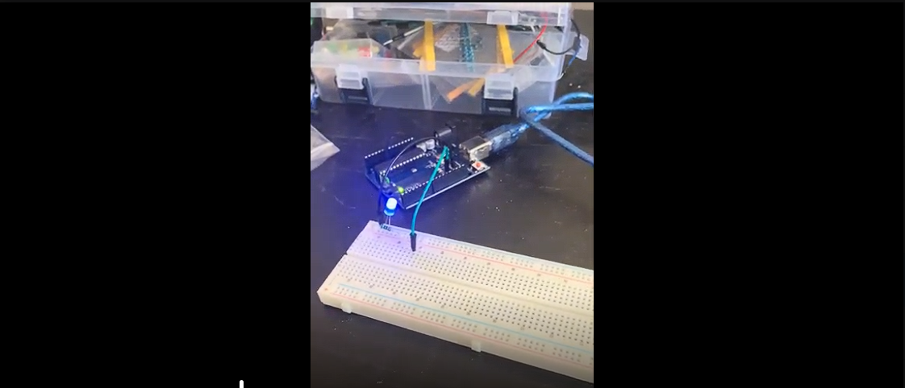

# Flickering an LED on and Off
My first Arudino project. Added Output messages when the LED is ON or OFF with 2000ms delay for when on and 1000ms delay when off
## Video
Click Thumbnail to see the full Video demonstration

